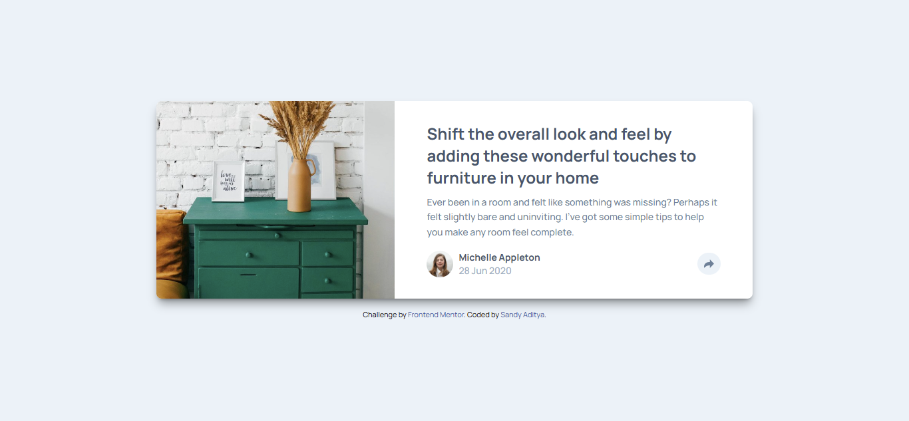

# Frontend Mentor - Article preview component solution

This is a solution to the [Article preview component challenge on Frontend Mentor](https://www.frontendmentor.io/challenges/article-preview-component-dYBN_pYFT). Frontend Mentor challenges help you improve your coding skills by building realistic projects.

## Table of contents

- [Overview](#overview)
  - [The challenge](#the-challenge)
  - [Screenshot](#screenshot)
  - [Link](#link)
- [My process](#my-process)
  - [Built with](#built-with)
  - [AI Collaboration](#ai-collaboration)
- [Author](#author)

## Overview

### The challenge

Users should be able to:

- View the optimal layout for the component depending on their device's screen size
- See the social media share links when they click the share icon

### Screenshot



### Link

- Solution URL: [Add solution URL here](https://your-solution-url.com)
- Live Site URL: [Add live site URL here](https://your-live-site-url.com)

## My process

### Built with

- Semantic HTML5 markup
- CSS custom properties
- Flexbox
- CSS Grid
- Mobile-first workflow
- [Tailwind CSS](https://tailwindcss.com/) - For styles

### What I learned

In this project, I used the sorting class from Prettier to sort Tailwind CSS classes.

```sh
npm install -D prettier prettier-plugin-tailwindcss
```

I used the above command to install the Prettier and prettier-plugin-tailwindcss packages.

Once the packages are installed, I need to create a file in the root folder to add the plugin to the Prettier configuration.

```json5
// .prettierrc
{
  plugins: ["prettier-plugin-tailwindcss"],
}
```

I added the above code to instruct Prettier to use the class sorting plugin.

### AI Collaboration

- In this project, I used Gemini 3 Flash.
- I used AI for debugging purposes and to request solutions to some of the problems I encountered.

## Author

- Website - [My Website](https://sandyaditya123.github.io)
- Frontend Mentor - [@sandyaditya123](https://www.frontendmentor.io/profile/sandyaditya123)
- Github - [@sandyaditya123](https://github.com/sandyaditya123)

```

```
